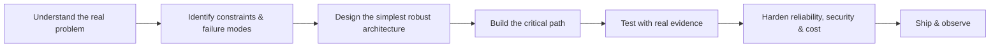

# Gopesh Jangid

### Senior Software Engineer · AI Product Engineer · Solution Architect

**I turn complex product and engineering problems into reliable software systems — across AI, web, mobile, cloud, and automation.**

13+ years building production software, modernizing platforms, and taking ideas from architecture to shipped products.

---

## What I Solve

| Problem | How I approach it |
|---|---|
| **AI is inconsistent or hard to trust** | RAG, reranking, structured outputs, evaluation, verification, bounded repair and deterministic checks |
| **AI workflows are slow or fragile** | Streaming, async execution, progress tracking, retries, idempotency, observability and cost/latency controls |
| **Products become difficult to scale or maintain** | Clear architecture, typed contracts, reusable components, event-driven workflows and regression-focused testing |
| **Mobile AI feels disconnected from the product** | Native Android UX, real-time AI streaming, local-first data, background workflows, billing and device-aware experiences |
| **Unstructured data is unreliable** | Python/OCR pipelines, provenance, classification, Pydantic validation and quality gates |
| **Teams need to move from prototype to production** | Cloud architecture, auth, APIs, queues, storage, monitoring, CI/CD, security and production hardening |

---

## What I Have Built

### AI & Agentic Systems
Built multi-stage systems combining:

**classification → retrieval → reranking → reasoning / tool use → verification → repair → response**

Worked on conversational AI, autonomous generation workflows, structured outputs, long-running jobs, automated evaluation, human review and reliability controls.

### AI-Native Mobile
Built native and cross-platform mobile applications with:

- Kotlin + Jetpack Compose
- React Native
- real-time AI response streaming
- contextual AI actions
- GraphQL subscriptions
- local-first caching
- Cognito authentication
- Google Play Billing
- analytics, crash reporting and privacy-aware telemetry
- voice, recommendations, moderation and real-time communication

### RAG & Knowledge Systems
Built retrieval systems with semantic search, vector storage, reranking, confidence thresholds, source tracking, caching and verification.

### Python Data & AI Automation
Built Python pipelines for document ingestion, OCR, classification, semantic binding, schema validation, batch automation and source-traceable structured outputs.

### Enterprise Web Platforms
Deep experience building and modernizing complex React applications, reusable design systems, SSR/hydration flows, GraphQL/REST integrations and high-performance frontend architecture.

### Cloud & Distributed Systems
Designed serverless, event-driven and real-time systems with AWS across authentication, APIs, queues, background processing, storage, AI inference and observability.

---

## How I Work

**Correctness over cleverness · Evidence over assumptions · Reliability over impressive demos**

---

## Capability Map

| Area | Focus |
|---|---|
| **Product & Solution Architecture** | 0→1 architecture, trade-offs, scalability, integration strategy, technical ownership |
| **Applied AI / LLM Systems** | Agents, RAG, tools, routing, structured outputs, evaluation, verification |
| **React / Frontend Engineering** | Architecture, performance, design systems, SSR/hydration, state and maintainability |
| **AWS / Serverless** | Bedrock, Lambda, AppSync, DynamoDB, Cognito, S3, SQS, Amplify |
| **Mobile Engineering** | Kotlin, Compose, React Native, streaming AI, billing, real-time data |
| **Python & Automation** | Document intelligence, validation pipelines, batch processing, AI/data workflows |
| **Reliability & Security** | Testing, retries, idempotency, observability, PII-aware telemetry, auth and failure analysis |

---

## Technology & AI Stack

**AI / Agents**  
OpenAI · Claude · Gemini / Gemma · Amazon Bedrock · Azure AI · LangGraph · LangChain · MCP · LangSmith · RAG · tool calling · model routing · evals · verification · AI automation

**AI-assisted Engineering**  
Claude Code · OpenAI Codex · Cursor · GitHub Copilot

**Frontend**  
React · Next.js · TypeScript · JavaScript · Redux Toolkit · Redux Saga · Zustand · Apollo · GraphQL · Vite · Webpack · Material UI · Tailwind CSS

**Mobile**  
Kotlin · Jetpack Compose · Android · React Native · Room · Google Play Billing

**Backend / Data**  
Node.js · Python · FastAPI · Fastify · Express · PostgreSQL · pgvector · DynamoDB · Redis / Upstash · REST · GraphQL

**Cloud / DevOps**  
AWS Bedrock · Lambda · AppSync · Cognito · S3 · SQS · Amplify Gen2 · CloudWatch · Docker · GitHub Actions · Jenkins

**Testing / Observability**  
Jest · React Testing Library · Cypress · Playwright · Vitest · Firebase Analytics · Crashlytics · LangSmith

---

## Selected Public Proof

- [Local AI with Gemma + LiteRT-LM + WebGPU](https://github.com/gopeshjangid/google-liteRT.js) — browser-local inference and edge AI
- [Document intelligence pipeline](https://github.com/gopeshjangid/all-converto-json) — structured extraction and AI-ready ingestion
- [RAG / AI service engineering](https://github.com/gopeshjangid/merit-ranker-tutor-agent) — retrieval, reranking, Bedrock, streaming and caching
- [Native Android AI engineering](https://github.com/gopeshjangid/meritranker-android-app) — Kotlin, Compose, streaming, subscriptions, billing and observability

---

## Current Focus

Agentic AI · LLM reliability · AI-native mobile · coding-agent testing & governance · on-device AI · developer tools · AI automation

---

## GitHub Activity

---

## Open To

**Applied AI / Agentic AI Engineering · AI Product Architecture · 0→1 Product Engineering · React Architecture · AI-Native Mobile · AWS AI Systems · Technical Consulting**

I am most useful where **product, architecture, AI, reliability and execution** meet.
